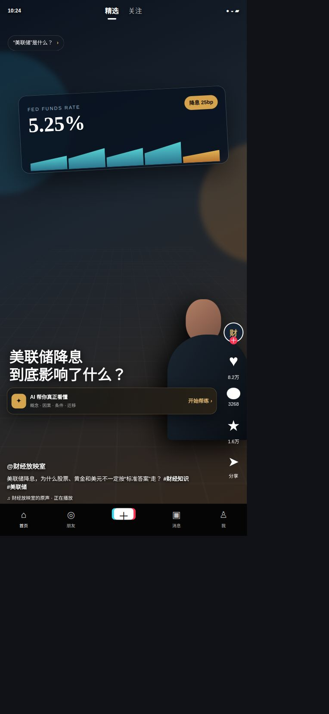
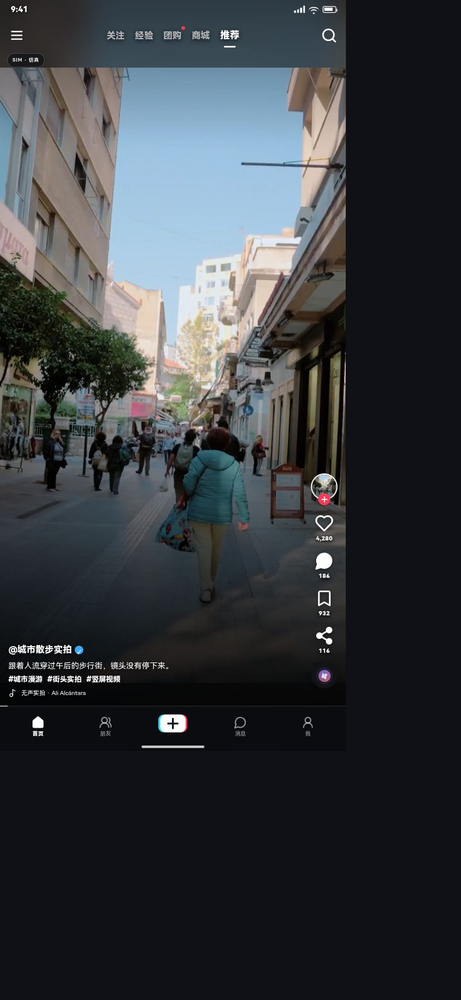
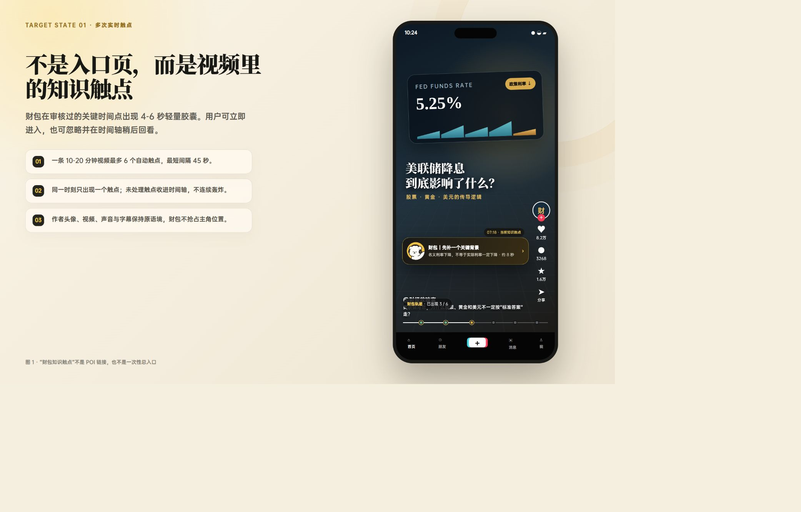
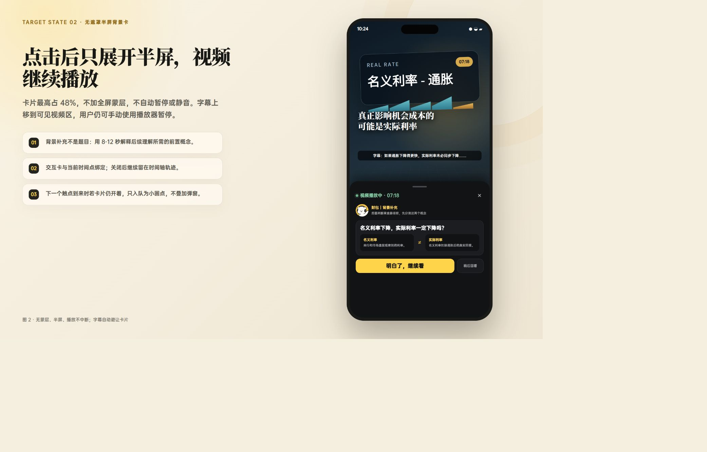
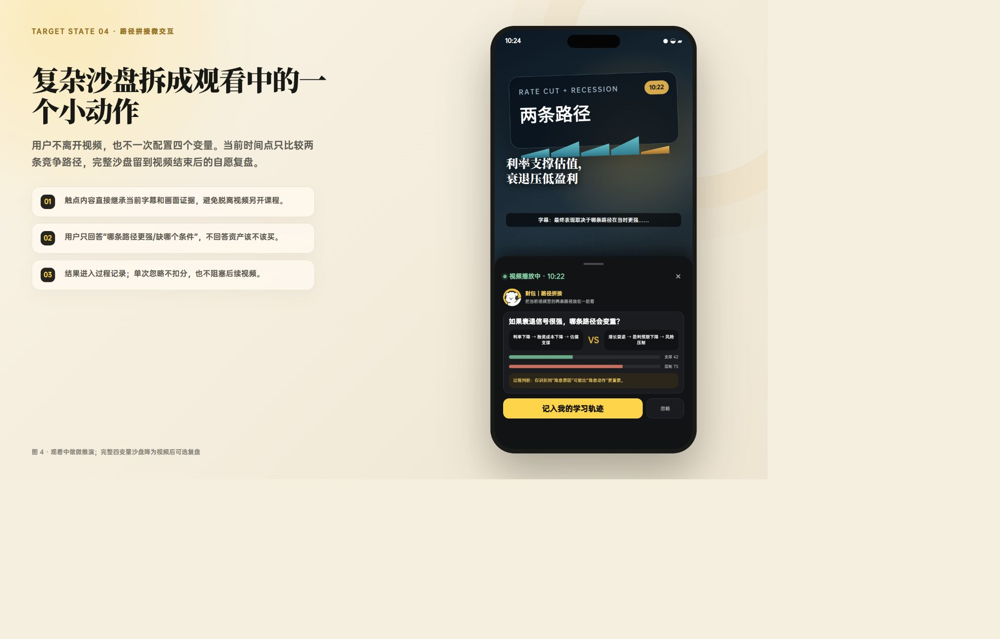
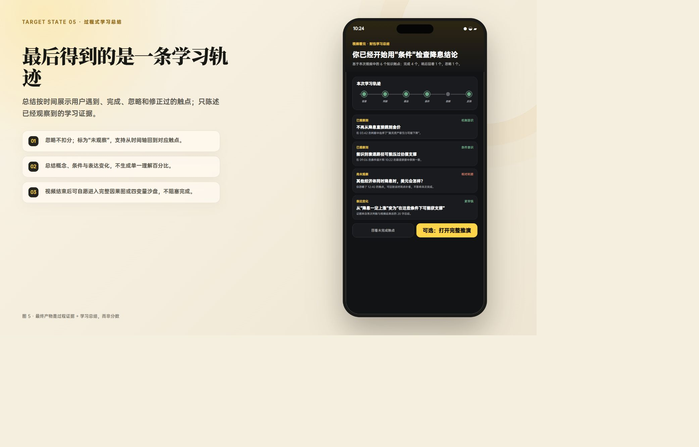
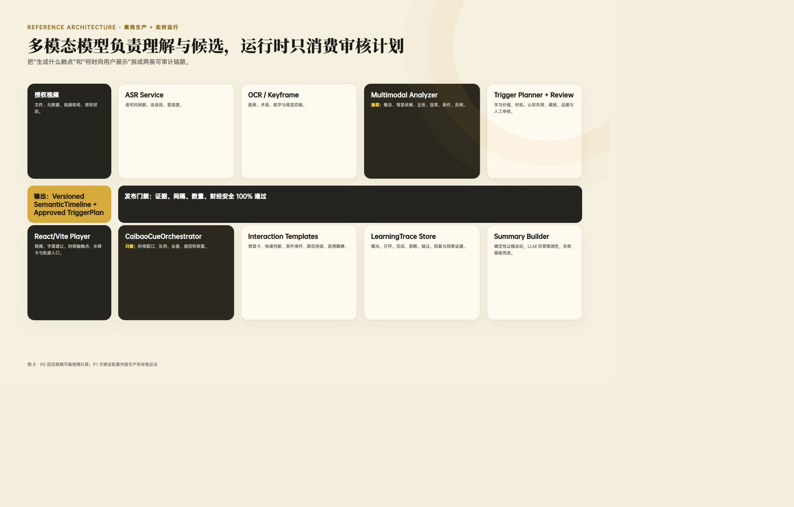

<h1 align="center">
  财经推演室 · 财包 / Caibao
</h1>

<p align="center">
  <em>把一条财经短视频，变成它自己时间轴上的语义交互层</em>
</p>

<p align="center">
 <a href="docs/README.en.md">English</a> | <a href="docs/README.es.md">Spanish</a> | <a href="docs/README.de.md">German</a> | 
<a href="docs/README.fr.md">French</a> | <a href="README.md">简体中文</a> |  <a href="docs/README.ja.md">日本語</a> 
</p>

<p align="center">
  
  <a href="LICENSE"></a>
  
</p>

> **财包（Caibao）** 是视频里的一只引导小狗。视频照常播放，财包在**已审核的关键时间点**浮出少量、可忽略的「知识触点」；点开是一个**不打断播放**的半屏微交互；视频看完，沉淀成一条**过程式学习轨迹**。
>
> 它**不是**课程、**不是**聊天机器人、**不做**涨跌预测、**不给**买卖建议——只解释概念、条件与因果机制。产品名为「财经推演室」。

> [!WARNING]
> 本仓库当前是**工程原型**，存在明确的发布阻塞项（见文末[「当前状态」](#当前状态工程原型)）。下文**核心能力**中的手机配图是**目标设计稿（target state）**，**不是当前已上线形态**；唯一反映当前真实运行状态的是下面这张演示截图。

## 一眼看懂（当前实现）

打开 `http://127.0.0.1:3001/?demo=finance-fed` 看到的工程原型：财包在推荐流里，用一条**合成占位视频**验证「时间轴触点 + 半屏解释 + 连续播放」的机制。

<p align="center">
  
</p>

<details>
<summary>与底座模拟器对照（before / after，均为真实截图）</summary>

<p align="center">
  
  &nbsp;&nbsp;
  
</p>

左：上游 douyin-vue 底座模拟器；右：叠加财包知识触点后。

</details>

## 核心能力

> [!NOTE]
> 以下每条能力附的手机图均为**目标设计稿**，用于说明交互意图；当前已实现的代码见括注文件，行为约束由 `src/features/finance-cues/contracts.ts` 的 Zod schema 强制。

**1 · 视频里的知识触点（触点胶囊）** — `components/CuePill.vue`

在已审核的关键时间点浮出 4–6 秒的轻量胶囊：财包头像 + 类型标签 + 一句钩子 + 「打开 / 稍后」。它**使用财包头像，从不替换作者头像**；点击胶囊或其控件不会触发底座播放器的「点按暂停」。

<p align="center"></p>

**2 · 无遮罩半屏卡** — `components/CaibaoHalfSheet.vue`

点开后只展开半屏（最高 48vh），**无全屏蒙层、不暂停、不静音、不缩放视频**，播放全程持续。可下拉、点关闭或「稍后看」收起。

<p align="center"></p>

**3 · 轻量微交互模板** — `components/InteractionRenderer.vue`

每个触点只完成一个小认知动作：**背景补丁**（`context_card`，补一个前置概念）、**条件拨片**（`condition_slider`，改一个变量看两种结果）、**路径拼接**（`causal_stitch`，补一条缺失的因果边）。

> PRD 规划了 6 类模板；**当前 `InteractionRenderer.vue` 已渲染的是上述三种**（`context_card` / `condition_slider` / `causal_stitch`）。

**4 · 路径拼接微交互** — 把复杂沙盘拆成观看中的一个小动作

用户不离开视频、也不一次配置多个变量；当前时间点只比较两条竞争路径，完整沙盘留到视频结束后自愿复盘。用户只回答「哪条路径更强 / 缺哪个条件」，**不回答资产该不该买**。

<p align="center"></p>

**5 · 过程式学习总结（无评分）** — `components/LearningSummaryView.vue`

视频结束给一份总结，只呈现「你已经碰到」与「尚未观察」，并支持从时间轴回到对应触点。**没有总分、没有百分比、没有排名、没有买卖建议**；未点击的内容标记为「尚未观察」，绝不写成「未掌握」，也不扣分。

<p align="center"></p>

**6 · 确定性触点编排器** — `orchestrator.ts`

跟随毫秒级媒体时钟，**同一时刻最多浮出 1 个触点**（就近触发，优先级破平）；若半屏已打开，后到触点只记为 `missed`，不叠弹窗、不排队。忽略只记为「未观察」，不是惩罚。

上述行为不是口头约定，而由 schema 强制：`maxAutomaticCues ≤ 6`、`minGapMs ≥ 45000`（≥45 秒）、`maxConcurrent = 1`、`keepPlayback = true`、`cueDurationMs 4000–6000`、`halfSheetMaxRatio ≤ 0.48`，且每个触点必须 `reviewStatus: 'approved'` 并至少引用 1 个 `evidenceId`。

## 工作原理

<p align="center"></p>

- **离线生产链路**：先理解整条视频（ASR / OCR / 多模态），把少量高价值节点规划为触点，**100% 人工审核**后生成版本化的语义时间轴与触点计划。
- **实时运行链路**：客户端只消费**已审核**的计划；Agent 只负责编排曝光，**不在现场决定财经结论**。

后端（Node + Express + TypeScript，绑定 `127.0.0.1:18787`）要点：

- **证据门禁**：必须有已声明处理权的 `MediaAsset` 才分析；每条语义项（概念 / 主张 / 因果边 / 条件）都要引用来自 ASR/OCR 的 `evidenceId`；ASR 时间不得越过媒体时长。
- **模型只出候选**：流水线输出恒为 `draft`（`publishStatus: 'draft'`、`approvedTriggers: []`、`blockers: ['HUMAN_REVIEW_REQUIRED']`），健康检查对外声明 `modelCanPublish: false`。人工审核是硬门禁。
- **确定性 cue-planner**：带 `UNSAFE_FINANCIAL_LANGUAGE` 正则，拦截买入/卖出/仓位/目标价/稳赚/必涨等措辞。
- **Provider**：MiniMax / 方舟语义、火山豆包 ASR、火山 OCR（SigV4，**默认关闭**）；抖音公开主页**合规探测** + 创作者 OAuth **仅元数据**客户端（不下载媒体、不绕过登录/验证码/签名/风控）。

> 后端细节见 [`server/README.md`](server/README.md)。
> 说明：**当前前端仍读静态 fixture `finance-fed-v1`（`src/features/finance-cues/fixtures/`），尚未接入 server API。**

## 技术栈

- **底座**：Vue 3 + Vite + Pinia + TypeScript（上游 `douyin-vue`，本地 `axios-mock-adapter` 提供 mock 数据，无真实后端）。
- **财包前端**：`src/features/video-extensions/`（通用视频扩展宿主 / 契约 / 注册表）+ `src/features/finance-cues/`（Zod 契约、Pinia + `localStorage` 会话存储、确定性 orchestrator、5 个 Vue 组件、静态 fixture）。
- **财包后端**：`server/src/`（Express + Zod + dotenv + fetch 版 HTTPS provider 客户端 + `child_process` FFmpeg 适配 + 原生 Volcengine 签名 V4）。
- **测试**：前端 Vitest、服务端 Vitest（默认离线）、Playwright 多视口 E2E。

## 本地运行

```bash
git clone https://github.com/wzxsph/douyin.git
cd douyin
git checkout feat/caibao-analysis-pipeline
pnpm install

# 只监听回环地址启动前端（工程原型启动方式）
pnpm exec vite --host 127.0.0.1 --port 3001 --strictPort
```

打开财包演示：`http://127.0.0.1:3001/?demo=finance-fed`

> 手机模式预览：`F12` 调出控制台，再按 `Ctrl+Shift+M`。
>
> 请勿使用 `pnpm dev / start / serve`——这些脚本会用 `vite --host` 覆盖回环配置、可能监听 `0.0.0.0`。

可选后端（默认离线，健康检查不产生模型费用）：见 [`server/README.md`](server/README.md)；创建真实分析任务可能调用 ASR / 模型，须先确认素材权利与费用。

## 当前状态：工程原型

存在明确的发布阻塞项，请勿当作可交付的成品：

- 模型输出永远是**候选**，须**人工审核**才能上线；尚无人工审核台 / 发布 API / 数据库（任务仅内存态）。
- **尚未做任何真实计费的端到端跑通**（本机无 FFmpeg/FFprobe、无授权真实视频，Provider 未经真实成本/延迟/质量验证）。
- 前端仍用静态 fixture，未接 server API；6 类交互模板**只实现 3 类**；OCR 默认关闭。
- 底座依上游为 **GPL + 非商业**，本 fork **不作为商业产品**呈现。

## 范围与边界（红线）

- **不提供买卖建议**，不给仓位、目标价、收益承诺；只解释概念、条件与因果机制。
- **证据门禁**：无 `MediaAsset`、无处理权声明、无 `evidenceId` 不分析。
- **不做用户画像**：不保存原始语音，不推断用户财富状况、风险偏好或投资能力。
- **播放永不被打断**：半屏 ≤ 48vh、无蒙层，不暂停、不静音、不倒带、不缩放视频。
- **演示用合成占位视频**（`./demo/finance-media-placeholder.webm`）；对外发布前必须替换为**已授权视频、最终字幕、真实时间码与审核后的 evidenceId**。
- **来源合规**：公开可见 ≠ 有权下载或再处理；不绕过登录、验证码、签名或风控。

> 完整内容边界与演示说明见 [`NOTICE-FINANCE-DEMO.md`](NOTICE-FINANCE-DEMO.md)。

## 致谢与许可

- 本项目基于 [zyronon/douyin](https://github.com/zyronon/douyin)（`douyin-vue`，一个模仿抖音 / TikTok 的移动端短视频模拟器）二次开发，感谢原作者。
- 财包能力为在此基础上的新增，位于 `src/features/`（`video-extensions` 与 `finance-cues`）与 `server/`，改动在 `feat/caibao-analysis-pipeline` 分支。
- 遵循 [GPL-3.0](LICENSE)（继承上游）；上游底座仅供学习研究、不得商用，本 fork 沿用同一约束。
- 产品设计与架构文档（PRD 等）：产品仓 [wzxsph/caibao](https://github.com/wzxsph/caibao)。
